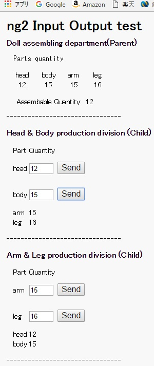

# kawa01
my first github  
2017/01/28 add this line  
angular2-input-output-test  

Language: Google AngularDart  
Sample contents:  Angular2 @Input @Output test  

## How to run
1. step0
  * get dart SDK
  * get dartium
2. step1
  * pub get     (My stick PC takes 45 minutes)
  * pub serve   (about 1 minute)
3. step2
  * set http://localhost:8080/ to browser
4. step3
  * click **Send** buttons
5. snapshot
  * 
